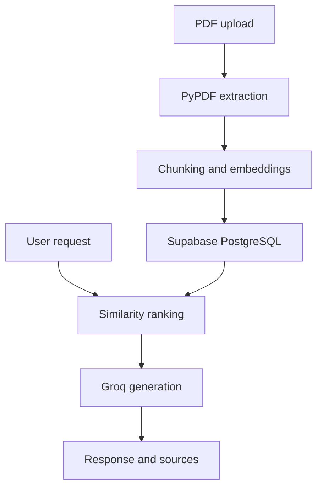

# DocuMind Backend

FastAPI backend for **DocuMind**, an AI-powered document assistant that lets users upload PDFs, ask document-grounded questions, generate summaries, create quizzes and flashcards, and receive responses with page-level sources.

[Live Demo](https://documind-frontend-nine.vercel.app/login) | [Frontend Repository](https://github.com/Saideep2019/documind-frontend) | [Backend Source](https://github.com/Saideep2019/AI-Powered-Knowledge-Assistant/tree/quiz-fix/backend)

## Features

- Extracts text from uploaded PDF documents with PyPDF
- Splits page text into overlapping chunks
- Generates embeddings with `sentence-transformers/all-MiniLM-L6-v2`
- Stores document chunks, embeddings, and metadata in Supabase PostgreSQL
- Ranks document chunks using cosine similarity
- Supports document-grounded chat with recent conversation history
- Returns source filenames and page numbers with answers
- Generates five-question multiple-choice quizzes
- Generates five study flashcards from document content
- Produces structured document summaries
- Lists and deletes documents by user ID

## Architecture



## How Retrieval Works

1. The client uploads a PDF and supplies a user ID.
2. The backend extracts text page by page and splits it into overlapping chunks.
3. SentenceTransformer generates an embedding for every chunk.
4. The backend stores the text, embedding, page number, filename, chunk index, and user ID in the Supabase `document_chunks` table.
5. For a question, the backend embeds the query and retrieves the user's document chunks.
6. It calculates cosine similarity and selects the three most relevant chunks above the configured threshold.
7. The selected context and recent conversation history are sent to Groq.
8. The API returns the generated answer with matching filename and page information.

## Technology Stack

- **Language:** Python
- **API:** FastAPI and Uvicorn
- **Database:** Supabase PostgreSQL
- **PDF processing:** PyPDF
- **Embeddings:** SentenceTransformers (`all-MiniLM-L6-v2`)
- **Similarity:** NumPy cosine similarity
- **LLM provider:** Groq
- **Model:** `llama-3.3-70b-versatile`
- **Validation:** Pydantic

## API Endpoints

FastAPI provides interactive API documentation at `/docs` while the server is running.

| Method | Endpoint | Purpose | Main inputs |
| --- | --- | --- | --- |
| `GET` | `/` | Health check | None |
| `POST` | `/upload` | Upload, chunk, embed, and store a PDF | Multipart `user_id` and `file` |
| `POST` | `/ask` | Ask a document-grounded question | `question`, `history`, `selected_document`, `user_id` |
| `POST` | `/generate-quiz` | Generate five multiple-choice questions | `document`, `user_id` |
| `POST` | `/generate-flashcards` | Generate five flashcards | `document`, `user_id` |
| `GET` | `/documents` | List a user's uploaded PDFs | Query parameter `user_id` |
| `POST` | `/summarize` | Generate a structured document summary | `document`, `user_id` |
| `DELETE` | `/documents/{filename}` | Delete a PDF and its stored chunks | Path `filename`, query parameter `user_id` |

## Local Setup

### Prerequisites

- Python 3.10 or newer
- A Groq API key
- A Supabase project containing a `document_chunks` table

### Installation

```bash
git clone --branch quiz-fix https://github.com/Saideep2019/AI-Powered-Knowledge-Assistant.git
cd AI-Powered-Knowledge-Assistant/backend
python -m venv .venv
```

Activate the environment on Windows PowerShell:

```powershell
.\.venv\Scripts\Activate.ps1
```

Activate it on macOS or Linux:

```bash
source .venv/bin/activate
```

Install dependencies:

```bash
pip install -r requirements.txt
```

Create `backend/.env`:

```env
GROQ_API_KEY=your_groq_api_key
SUPABASE_URL=your_supabase_project_url
SUPABASE_SERVICE_ROLE_KEY=your_supabase_service_role_key
```

Never commit `.env` or expose the service-role key in frontend code.

Start the server from `backend/`:

```bash
uvicorn main:app --reload
```

Then open:

- API: `http://127.0.0.1:8000`
- Swagger UI: `http://127.0.0.1:8000/docs`
- ReDoc: `http://127.0.0.1:8000/redoc`

The first startup may take longer while SentenceTransformer downloads the embedding model.

## Expected Database Fields

The backend reads and writes the following fields in the Supabase `document_chunks` table:

| Field | Purpose |
| --- | --- |
| `id` | Unique row identifier |
| `user_id` | Associates chunks with a user |
| `filename` | Original PDF filename |
| `page` | Source page number |
| `chunk_index` | Preserves document chunk order |
| `content` | Extracted text chunk |
| `embedding` | SentenceTransformer embedding |

## CORS

The current configuration allows the local frontend on ports `localhost:3000` and `127.0.0.1:3000`, along with matching DocuMind Vercel preview deployments.

## Security Note

The current API filters data using a client-provided `user_id`, but it does not independently verify a Supabase authentication token. Server-side token verification and ownership checks should be added before using the application with private or sensitive documents.

## Planned Improvements

- Verify Supabase access tokens on protected endpoints
- Move uploaded PDF files to durable cloud storage
- Add filename, file-type, and upload-size validation
- Add automated unit and API tests
- Add structured logging and error handling
- Separate routes, services, models, and data access into modules
- Add rate limiting and production monitoring

## License

Add a license before permitting redistribution or reuse.
